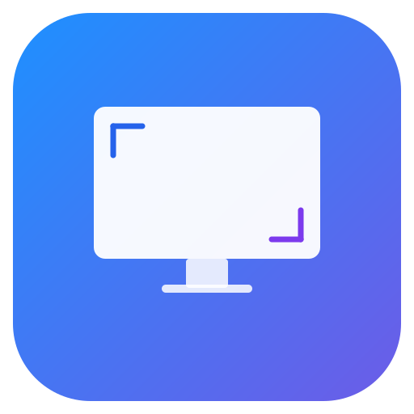

<p align="center">
  
</p>

<h1 align="center">SimpleDisplay</h1>

<p align="center">
  A lightweight macOS menu bar app for managing displays and creating virtual monitors.
</p>

<p align="center">
  <a href="https://github.com/SamuelRioTz/SimpleDisplay/releases/latest"></a>
  <a href="LICENSE"></a>
  <a href="https://github.com/SamuelRioTz/SimpleDisplay/actions/workflows/build.yml"></a>
  
</p>

---

## Features

- **Enable/Disable displays** — toggle monitors on and off without unplugging them
- **Virtual displays** — create virtual monitors with custom resolutions and device presets (iPhone, iPad, Mac, TV)
- **Set main display** — change your primary monitor from the menu bar
- **HiDPI support** — create Retina virtual displays
- **Sleep/Wake safe** — automatically handles display state across sleep cycles
- **ColorSync fix** — prevents colorsync deadlock with identical monitors (macOS Sequoia bug)
- **Lightweight** — lives in the menu bar, under 2MB, no background processes

## Install

### Download

Download the latest DMG from [Releases](https://github.com/SamuelRioTz/SimpleDisplay/releases/latest), open it, and drag SimpleDisplay to Applications.

> **First launch:** Right-click the app → Open (required for unsigned apps).

### Build from source

```bash
git clone https://github.com/SamuelRioTz/SimpleDisplay.git
cd SimpleDisplay
make dmg
open SimpleDisplay.app
```

Requires Xcode Command Line Tools (`xcode-select --install`).

## How it works

SimpleDisplay uses Apple's private `CGVirtualDisplay` API to create virtual monitors and `CGConfigureDisplayMirrorOfDisplay` to enable/disable physical displays via mirroring.

**Disabling a display** mirrors it to another active display (effectively turning it off). This is reversed by removing the mirror relationship.

**Virtual displays** appear as real monitors to macOS — useful for screen sharing specific resolutions, testing responsive layouts, or keeping apps running on a "hidden" screen.

## Requirements

- macOS 14.0 (Sonoma) or later
- Apple Silicon or Intel

## Known limitations

- Uses private Apple APIs — **cannot be distributed on the Mac App Store**
- Virtual display refresh rate is capped at 60Hz (API limitation)
- Display identification uses names, so two identical monitors may not be distinguishable in all scenarios
- The `CGVirtualDisplay` API may change or be removed in future macOS versions

## Contributing

See [CONTRIBUTING.md](CONTRIBUTING.md) for build instructions and guidelines.

## License

[GPL-3.0](LICENSE)

## Acknowledgments

Built with insights from the macOS display management community, including [BetterDisplay](https://github.com/waydabber/BetterDisplay), [DeskPad](https://github.com/Stengo/DeskPad), and [displayplacer](https://github.com/jakehilborn/displayplacer).
