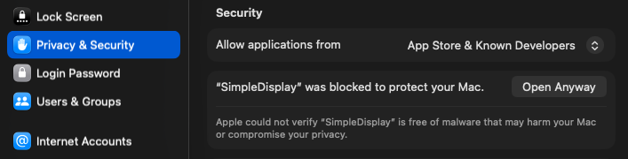

<p align="center">
  
</p>

<h1 align="center">SimpleDisplay</h1>

<p align="center">
  A lightweight macOS menu bar app for managing displays and creating virtual monitors.
</p>

<p align="center">
  <a href="https://github.com/SamuelRioTz/SimpleDisplay/releases/latest"></a>
  <a href="LICENSE"></a>
  <a href="https://github.com/SamuelRioTz/SimpleDisplay/actions/workflows/build.yml"></a>
  
</p>

---

## Features

- **Enable/Disable displays** — toggle monitors on and off without unplugging them
- **Virtual displays** — create virtual monitors with custom resolutions and device presets (iPhone, iPad, Mac, TV)
- **Set main display** — change your primary monitor from the menu bar
- **HiDPI support** — create Retina virtual displays
- **Sleep/Wake safe** — automatically handles display state across sleep cycles
- **ColorSync fix** — prevents colorsync deadlock with identical monitors (macOS Sequoia bug)
- **Lightweight** — lives in the menu bar, under 2MB, no background processes

## Install

### Download

Download the latest DMG from [Releases](https://github.com/SamuelRioTz/SimpleDisplay/releases/latest), open it, and drag SimpleDisplay to Applications.

### First launch

Since SimpleDisplay uses private APIs and isn't notarized, macOS will block it on first launch. To open it:

1. Open **System Settings → Privacy & Security**
2. You'll see a message saying SimpleDisplay was blocked
3. Click **Open Anyway**

<p align="center">
  
</p>

> This only needs to be done once. After that, the app opens normally.

### Build from source

```bash
git clone https://github.com/SamuelRioTz/SimpleDisplay.git
cd SimpleDisplay
make dmg
open SimpleDisplay.app

# Optional: install the CLI for automation
make cli-install          # /usr/local/bin/simpledisplayctl
```

Requires Xcode Command Line Tools (`xcode-select --install`).

## Automation

SimpleDisplay exposes a `simpledisplay://` URL scheme and a `simpledisplayctl`
CLI so the app can be driven from shell scripts, Shortcuts, SSH, or launchd
agents. The URL scheme activates the app if it is not already running — there
is no separate background process to keep alive.

### URL scheme

| URL                                                                     | Effect                              |
| ----------------------------------------------------------------------- | ----------------------------------- |
| `simpledisplay://open`                                                  | Focus the menu bar.                 |
| `simpledisplay://create?width=N&height=N[&name=S][&refresh=N][&hidpi=true]` | Create a virtual display.           |
| `simpledisplay://remove?id=N` or `?name=S`                              | Remove a virtual display.           |
| `simpledisplay://reconfigure?id=N&width=N&height=N[&refresh=N][&hidpi=true]` | Resize a virtual display in place. |

Values are validated — dimensions clamp to 100–8192, refresh capped at 60 Hz,
names rejected if they contain control characters — before the app sees them.
Malformed URLs surface as a one-line banner in the menu bar rather than
failing silently.

### CLI

```bash
make cli                  # build .build/apple/Products/Release/simpledisplayctl
make cli-install          # copy to /usr/local/bin (override with CLI_INSTALL_DIR)

simpledisplayctl create --width 2732 --height 2048 --name "iPad Pro" --hidpi
simpledisplayctl remove --name "iPad Pro"
simpledisplayctl reconfigure --id 3 --width 1600 --height 1200
simpledisplayctl open
simpledisplayctl status   # exit 0 = installed, 2 = missing; prints pid if running
```

`simpledisplayctl` is a thin wrapper — every action builds a
`simpledisplay://` URL and hands it to `/usr/bin/open`. Running the CLI from
an SSH session drives the remote Mac's local SimpleDisplay.

### Remote usage (SSH)

```bash
ssh user@mac "simpledisplayctl create --width 2732 --height 2048 --name iPad"
```

If SimpleDisplay is not installed, `status` reports that before any action
is attempted so callers can offer to install it first.

## How it works

SimpleDisplay uses Apple's private `CGVirtualDisplay` API to create virtual monitors and `CGConfigureDisplayMirrorOfDisplay` to enable/disable physical displays via mirroring.

**Disabling a display** mirrors it to another active display (effectively turning it off). This is reversed by removing the mirror relationship.

**Virtual displays** appear as real monitors to macOS — useful for screen sharing specific resolutions, testing responsive layouts, or keeping apps running on a "hidden" screen.

## Requirements

- macOS 14.0 (Sonoma) or later
- Apple Silicon or Intel

## Known limitations

- Uses private Apple APIs — **cannot be distributed on the Mac App Store**
- Virtual display refresh rate is capped at 60Hz (API limitation)
- Display identification uses names, so two identical monitors may not be distinguishable in all scenarios
- The `CGVirtualDisplay` API may change or be removed in future macOS versions

## Contributing

See [CONTRIBUTING.md](CONTRIBUTING.md) for build instructions and guidelines.

## License

[GPL-3.0](LICENSE)

## Acknowledgments

Built with insights from the macOS display management community, including [BetterDisplay](https://github.com/waydabber/BetterDisplay), [DeskPad](https://github.com/Stengo/DeskPad), and [displayplacer](https://github.com/jakehilborn/displayplacer).
